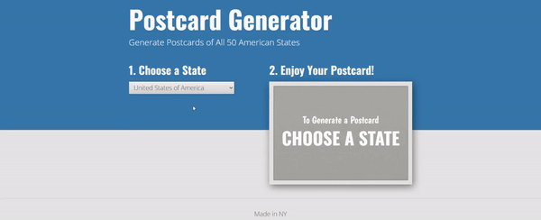

# Interactive Postcard Generator

# Instructions  

## First
> 1. Preview `index.html` in Chrome (use Chrome’s Inspector later).
> 2. Notice the Choose a State menu on the left. When the user selects a state, we want to use JavaScript to generate a postcard with that state’s name and a photo (showing the shape of the state).

## Next
> 1. Within the `img` folder there are 52 images: one for each of the 50 states, one for D.C., and one for the default “empty-state”. We’ve named each state’s image with the appropriate 2-letter abbreviation for that state
> 
> 2. Find the `select` tag. The `select` tag creates the **Choose a State** menu. Notice it has an `id` of `states`.
> 
> 3. Within the `<select>` tag, notice there are `<option>` tags for each state
> 
>	 - Each `<option>` tag has a `<value>` attribute, which we have assigned a 2-letter state abbreviation. These abbreviations match our corresponding image file names.
>	 - To generate the postcard, we will get the specific `value` from the `<option>` that the user chooses. We’ll then use that `value` to know which image to display.
>
> 4. Locate the `
` tag with `id="postcard"`. We’ll be assigning the selected state’s image (as a `background-image`) to this div.
>
> 5. Locate the `
` tag with `id="state-heading"`. We’ll be changing this text to the state’s name.

# Things to Think About
### Use `console.log()` to help you figure it out
> 1. String concatenation
> 2. getElementById
> 3. Use the dropdown options to get the state's name
>	 - [Help using dropdown options](https://www.w3schools.com/jsref/coll_select_options.asp)